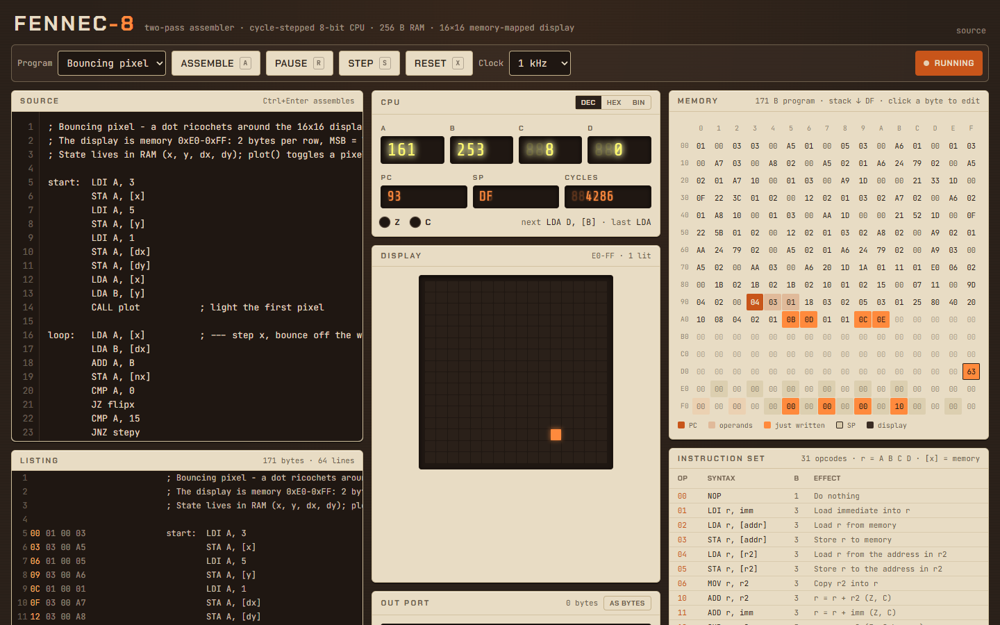

# Fennec-8

A two-pass assembler and cycle-stepped 8-bit CPU emulator with registers, flags, a 256-byte
memory grid, and a memory-mapped 16x16 pixel display.



Pick **Bouncing pixel**, hit **Run**, and watch the memory grid flicker as bytes change while
the 16x16 display shows a dot ricocheting off the walls — all driven by a CPU you can pause,
single-step, and poke at.

## Features

- **Assembler** — labels, `;` comments, `.byte` / `.word` directives (including strings),
  decimal / hex (`0x2A`, `$2A`) / binary (`0b101`, `%101`) / char (`'A'`) / negative literals,
  labels usable as immediates, and two-pass label resolution. Undefined and duplicate labels,
  unknown mnemonics, bad operands and out-of-range values all report the source line.
- **Instruction set** — 22 mnemonics / 31 opcodes: `LDI LDA STA MOV ADD SUB AND OR XOR SHL SHR
  CMP JMP JZ JNZ JC PUSH POP CALL RET OUT HLT` (+ `NOP`). ALU ops take a register or an
  immediate; `LDA` / `STA` take `[addr]` or `[reg]`.
- **Emulator** — registers A B C D, PC, SP, Z / C flags, 256 bytes of RAM. The upper 32 bytes
  (`0xE0-0xFF`) are a 16x16 one-bit display; the stack grows down from `0xDF`.
- **Controls** — assemble, run at 4 Hz to 16 kHz, step, reset; the current PC is lit in both the
  listing and the memory grid, with operand bytes tinted.
- **CPU panel** — seven-segment style readouts with DEC / HEX / BIN views, Z / C LEDs, and a
  flash on every register or flag that just changed.
- **Memory grid** — writes flash orange and fade over 400 ms; click (or arrow to and press Enter
  on) any byte to edit it in hex; hover a program byte to see its disassembly.
- **OUT port** — a console strip showing every byte written, as numbers or as text.
- **Examples** — counter, multiply, fibonacci, string print, bouncing pixel.
- Keyboard: `A` assemble, `R` run/pause, `S` step, `X` reset, `Ctrl+Enter` in the editor.

## How it works

**One table, three consumers.** `src/core/isa.ts` lists every opcode once — mnemonic, opcode
byte, operand form (`none`, `reg`, `reg,reg`, `reg,imm`, `reg,mem`, `reg,ind`, `addr`) and a
usage string. The operand form fixes the encoded size (1-3 bytes), so the assembler, the
disassembler and the CPU all agree on layout without repeating it. Overloaded mnemonics such as
`ADD r, r2` and `ADD r, imm` are simply two rows with different forms; the assembler picks the
row whose form matches the operand shapes it parsed.

**Two passes.** Each line is tokenised into `label:`, mnemonic, and comma-separated operands
(commas inside `"strings"` and `[brackets]` are ignored). Pass one walks the lines, sizes each
instruction or directive, and records `label -> address`. Pass two encodes opcodes and operand
bytes into a `Uint8Array`, resolving numbers and labels as it goes; an unresolved name throws
`Undefined label "x" on line N`. The result also carries a listing (line, address, bytes) and an
address-to-line map that the UI uses to light the current row.

```
        LDI A, 5            01 00 05     opcode, register, immediate
loop:   SUB A, 1            13 00 01     "loop" = 0x03 recorded in pass one
        JNZ loop            22 03        label substituted in pass two
        HLT                 FF
```

**Fetch, decode, execute.** `CPU.step()` reads the opcode at PC, looks it up in the table,
fetches exactly the operand bytes that form requires, and executes. Arithmetic wraps at 8 bits;
`Z` is set when a result is zero, `C` on carry out of `ADD`, on borrow for `SUB` / `CMP`, and
on the shifted-out bit for `SHL` / `SHR`. `CALL` pushes the one-byte return address and `RET`
pops it. Every instruction costs one cycle, a control transfer that actually reloads PC (`JMP`,
a taken `JZ` / `JNZ` / `JC`, `CALL`, `RET`) costs one more, and `HLT` stops the clock for free —
so the loop above costs 9 cycles. The UI runs the clock from `requestAnimationFrame`, spending
`Hz x dt` cycles per frame, and each step reports what it wrote so the panels can flash only
what changed.

## Run it

```sh
npm install
npm run dev        # local dev server
npm run build      # type-check + production build to dist/
npm test           # vitest: assembler, CPU, disassembler and example programs
```

Append `?autorun` to the URL to start the bundled program on load.

## Tech

React 19, TypeScript (strict), Vite 8, Tailwind CSS 4, Vitest 5. Fonts: Share Tech Mono,
JetBrains Mono, Chakra Petch via `@fontsource`. No runtime dependencies beyond React.

## License

MIT — see [LICENSE](LICENSE).
